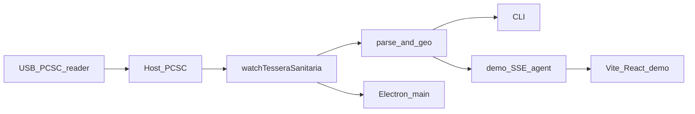

# tessera-sanitaria-reader

TypeScript library and CLI that reads **anagraphic data** from the Italian health insurance card (**tessera sanitaria / TS-CNS**) through a PC/SC smart-card reader.

[](https://github.com/gabrielemuscogiuri/tesseraSanitariaReader/releases)
[](LICENSE)

See [CHANGELOG.md](CHANGELOG.md) for the 1.0.0 release notes.

Dual package (ESM + CommonJS), CLI, and a browser client subpath. Municipality names ship as a single JSON asset. The React UI in this Git repository is a **local demo** and is not part of the published tarball.

**License:** MIT

## Install

Node.js **18+** and a PC/SC smart-card reader. The package is published as a **GitHub Release** (npm registry requires 2FA on the publisher account).

From the v1.0.0 tarball:

```bash
npm install https://github.com/gabrielemuscogiuri/tesseraSanitariaReader/releases/download/v1.0.0/tessera-sanitaria-reader-1.0.0.tgz
```

```bash
pnpm add https://github.com/gabrielemuscogiuri/tesseraSanitariaReader/releases/download/v1.0.0/tessera-sanitaria-reader-1.0.0.tgz
```

From git (builds `dist/` on install):

```bash
npm install github:gabrielemuscogiuri/tesseraSanitariaReader#v1.0.0
```

```bash
pnpm add github:gabrielemuscogiuri/tesseraSanitariaReader#v1.0.0
```

CLI, after a local install:

```bash
npx tessera-sanitaria-reader
```

The native addon `pcsclite` is installed as a dependency. On Linux you also need `pcscd` and `libpcsclite`. macOS and Windows already provide a PC/SC stack.

Do **not** import the main entry in a Vite/webpack browser bundle. Use `tessera-sanitaria-reader/client` in the frontend and keep a Node process on the machine that has the reader.

## What this project does

On card insert it selects the CNS elementary files, parses the personal-data TLV, resolves Italian cadastral municipality codes, and reconstructs the 20-digit card number printed on the back of the tessera.

**Out of scope**

- CNS login and authentication
- Certificate files such as `EF.C_Carta`
- PIN entry
- Writing or updating the card

## Why the browser cannot talk to the reader alone

`pcsclite` is a **Node.js native addon**. It binds to the host PC/SC stack and cannot be bundled by Vite, webpack, or any in-browser React app.

The [Web Smart Card API](https://wicg.github.io/web-smart-card/) is available only in isolated ChromeOS apps. On macOS, Linux, and Windows the USB reader stays owned by the operating system. A Node process on the same machine must perform the APDU exchange; a web page may only display the result.

## Architecture



| Consumer                            | Import                            | Runtime                                 |
| ----------------------------------- | --------------------------------- | --------------------------------------- |
| CLI, demo server, Electron **main** | `tessera-sanitaria-reader`        | Node 18+, `pcsclite`                    |
| Vite / React / Next **client**      | `tessera-sanitaria-reader/client` | Browser `EventSource` → local SSE agent |

Do not import the main entry in a browser bundle. It will fail to resolve the native addon.

## Requirements

- Node.js **18** or later
- **pnpm** for development in this repository
- A PC/SC-compatible contact smart-card reader
- Host PC/SC service:
  - **macOS:** CryptoTokenKit / PCSC (built in)
  - **Linux:** `pcscd` and `libpcsclite`
  - **Windows:** WinSCard (built in)

Verified with **BIT4ID miniLector EVO**, protocol T=1. Other CCID readers that expose the same CNS filesystem should work.

## Repository setup

To work on this repository:

```bash
git clone https://github.com/gabrielemuscogiuri/tesseraSanitariaReader.git
cd tesseraSanitariaReader
pnpm install
```

## Quick start

### CLI

```bash
npx tessera-sanitaria-reader
```

In this repository, with a reader attached:

```bash
pnpm dev
```

Insert the card when the reader is listed. JSON is printed to stdout. Empty chip fields are omitted.

### Local React demo

The UI is not published on npm. In this repo:

```bash
pnpm demo
```

That starts a loopback SSE agent on [http://127.0.0.1:3847/events](http://127.0.0.1:3847/events) and a Vite React app on [http://localhost:5173](http://localhost:5173). Override the agent port with `PORT`. Do not run the CLI and the demo server against the same reader at the same time.

### Node library

```ts
import { watchTesseraSanitaria } from 'tessera-sanitaria-reader';

const handle = watchTesseraSanitaria({
  onReader: (name) => {
    console.log('reader', name);
  },
  onCard: (data, { readerName }) => {
    console.log(readerName, data);
  },
  onRemove: ({ readerName }) => {
    console.log('removed', readerName);
  },
  onError: (error) => {
    console.error(error.message);
  },
});

handle.close();
```

## Node API

Main entry: `tessera-sanitaria-reader`.

| Export                           | Kind     | Description                                             |
| -------------------------------- | -------- | ------------------------------------------------------- |
| `watchTesseraSanitaria(options)` | function | Listens for readers, card insert, and removal           |
| `readCardData(reader)`           | function | Reads a card already present on a PC/SC reader          |
| `parsePersonalData(buffer)`      | function | Parses EF.Dati_personali without hardware               |
| `calculateCardId(raw)`           | function | Builds the 20-digit card number from EF.ID_Carta        |
| `CardData`                       | type     | Sparse anagraphic object after empty fields are dropped |
| `WatchOptions`                   | type     | Callbacks passed to the watcher                         |
| `WatchHandle`                    | type     | `{ close(): void }`                                     |
| `SmartCardReader`                | type     | Duck-typed PC/SC reader used by `readCardData`          |

### `WatchOptions`

| Callback                       | When                                |
| ------------------------------ | ----------------------------------- |
| `onCard(data, { readerName })` | Personal data was read successfully |
| `onReader?(readerName)`        | A reader appeared                   |
| `onRemove?({ readerName })`    | The card left the reader            |
| `onError?(error)`              | PC/SC or parse failure              |

The library does not `console.log` card fields. Logging belongs in the CLI, the demo agent, or the application.

`watchTesseraSanitaria` treats a card as readable only when it is **PRESENT**, not **MUTE**, and the ATR is non-empty. The first insert event on some readers is mute; it is ignored until the ATR is available.

## `CardData`

All properties are optional. `omitEmpty` removes `null`, `""`, and whitespace-only values, so missing chip fields do not appear in the object.

| Field                    | Source      | Notes                                                                         |
| ------------------------ | ----------- | ----------------------------------------------------------------------------- |
| `issuer`                 | TLV         | Issuer code as stored on the chip                                             |
| `issuer_region`          | derived     | Region name from the issuer code (`6160` → Puglia)                            |
| `issue_date`             | TLV         | `DD-MM-YYYY`                                                                  |
| `expiration_date`        | TLV         | `DD-MM-YYYY`                                                                  |
| `surname`                | TLV         |                                                                               |
| `given_name`             | TLV         |                                                                               |
| `date_of_birth`          | TLV         | `DD-MM-YYYY`                                                                  |
| `sex`                    | TLV         | `M` or `F`                                                                    |
| `height`                 | TLV         | Often empty on TS-CNS                                                         |
| `tax_payer_number`       | TLV         | Codice fiscale                                                                |
| `citizenship`            | TLV         | Often empty                                                                   |
| `city_of_birth_code`     | TLV or CF   | Catastale (e.g. `L419`); falls back to characters 12–15 of the codice fiscale |
| `city_of_birth`          | geo         | `"Tricase (LE)"` when the code is known                                       |
| `foreign_birth_country`  | TLV         |                                                                               |
| `birth_certificate_ref`  | TLV         |                                                                               |
| `city_of_residence_code` | TLV         | Catastale                                                                     |
| `city_of_residence`      | geo         | `"Taviano (LE)"` when known                                                   |
| `street`                 | TLV         | Often empty on this card generation                                           |
| `notes`                  | TLV         | Often empty                                                                   |
| `cardId`                 | EF.ID_Carta | 20 decimal digits                                                             |

Synthetic example (not a real person):

```json
{
  "issuer": "6160",
  "issuer_region": "Puglia",
  "issue_date": "01-01-2020",
  "expiration_date": "31-12-2030",
  "surname": "ROSSI",
  "given_name": "MARIO",
  "date_of_birth": "15-03-1980",
  "sex": "M",
  "tax_payer_number": "RSSMRA80C15L419X",
  "city_of_birth_code": "L419",
  "city_of_birth": "Tricase (LE)",
  "city_of_residence_code": "L074",
  "city_of_residence": "Taviano (LE)",
  "cardId": "80380000000000000000"
}
```

The last digit of `cardId` is a Luhn check digit. The sample value above is illustrative only; use `calculateCardId` on a 13-byte EF.ID_Carta buffer.

## Browser and React

Do **not** import the main package entry in Vite: it pulls `pcsclite`. Import only the client subpath. A Node agent that calls `watchTesseraSanitaria` must run on the same machine as the reader (`pnpm demo:server` in this repo, or your own process).

```ts
import {
  subscribeTesseraSanitaria,
  DEFAULT_TESSERA_EVENTS_URL,
  type CardData,
  type TesseraClientEvent,
} from 'tessera-sanitaria-reader/client';
```

`subscribeTesseraSanitaria(onEvent, url?)` opens `EventSource` against `url` (default `DEFAULT_TESSERA_EVENTS_URL`, `http://127.0.0.1:3847/events`) and returns `{ close() }`. The demo Vite proxy forwards `/events` to that agent.

This is not a public website integration. The visitor’s browser can only see a reader attached to **the PC that runs the agent**.

### SSE events

| `type`   | Payload                          |
| -------- | -------------------------------- |
| `hello`  | Sent on subscribe                |
| `reader` | `{ readerName }`                 |
| `card`   | `{ data: CardData, readerName }` |
| `remove` | `{ readerName }`                 |
| `error`  | `{ message }`                    |

### React hook

```ts
import { useEffect, useState } from 'react';
import { subscribeTesseraSanitaria, type CardData } from 'tessera-sanitaria-reader/client';

export function useTesseraSanitaria() {
  const [card, setCard] = useState<CardData | null>(null);
  const [error, setError] = useState<string | null>(null);

  useEffect(() => {
    const { close } = subscribeTesseraSanitaria((event) => {
      if (event.type === 'card') {
        setError(null);
        setCard(event.data);
      }
      if (event.type === 'remove') setCard(null);
      if (event.type === 'error') setError(event.message);
    });
    return close;
  }, []);

  return { card, error };
}
```

### Electron

In the **main** process, import `tessera-sanitaria-reader` and call `watchTesseraSanitaria`. Do not load `pcsclite` in the renderer.

## Card protocol

Filesystem layout follows the AgID CNS specification. SELECT uses `00 A4 08 00` plus the 4-byte path. Success status word is `90 00`. Reads that exceed 255 bytes are chunked (`READ BINARY`, `Le` ≤ 255).

### EF.Dati_personali — `11 00 11 02`

1. Read 6 bytes. Interpret them as ASCII hexadecimal; that integer is the payload length (example: `00006D` → 109 bytes).
2. Read `6 + payloadLength` bytes from offset 0.
3. Skip the 6-byte header. The remainder is a sequence of fields. Each field is two ASCII hex digits (length) plus that many Latin-1 bytes. Length `00` means skip to the next field.

Field order:

`issuer`, `issue_date`, `expiration_date`, `surname`, `given_name`, `date_of_birth`, `sex`, `height`, `tax_payer_number`, `citizenship`, `city_of_birth_code`, `foreign_birth_country`, `birth_certificate_ref`, `city_of_residence_code`, `street`, `notes`.

Dates on the chip are `DDMMYYYY` and are formatted to `DD-MM-YYYY` in `CardData`.

### EF.ID_Carta — `10 00 10 03`

1. Read 13 bytes.
2. Discard the first byte.
3. Interpret the remaining 12 bytes as ASCII.
4. Prefix `8038000`.
5. Append a Luhn check digit.

The result is the 20-digit number on the back of the tessera.

### Specifications

- [AgID CNS filesystem](https://www.agid.gov.it/sites/default/files/repository_files/documentazione_trasparenza/filesystemcns_20131216.pdf)
- [TS-CNS technical annex](https://sistemats1.sanita.finanze.it/portale/documents/20182/34254/allegato%2Btecnico%2BTS-CNS%2Bex%2BDL%2B78-2010_v22-06-12.pdf/2ef2b969-879c-64f5-2b0a-8bce9877c08f)

## Repository layout

```
src/
  index.ts                 public Node API
  client.ts                browser EventSource client (no pcsclite)
  cli.ts                   CLI entry
  types.ts                 CardData and watcher types
  constants.ts             APDU paths, TLV field list, region map
  apdu.ts                  promisified connect / transmit / select / read
  parse.ts                 TLV parser, Luhn, cardId, omitEmpty
  geo.ts                   cadastral lookup, issuer region
  session.ts               readCardData
  watch.ts                 reader lifecycle
  data/comuniCatastali.json
demo/                      Vite + React UI and SSE agent (not published)
test/                      Vitest, synthetic buffers only
scripts/build-comuni.mjs   regenerate the comuni map
dist/                      tsup output (the npm artifact)
```

The npm tarball contains `dist/`, `README.md`, and `LICENSE`. JavaScript stays small; cadastral names are one file at `dist/data/comuniCatastali.json`. The React demo is excluded.

## Development

```bash
pnpm install
pnpm test
pnpm typecheck
pnpm lint
pnpm build
```

| Script              | Role                                                 |
| ------------------- | ---------------------------------------------------- |
| `pnpm dev`          | CLI via `tsx src/cli.ts` (needs a reader)            |
| `pnpm demo`         | React demo (SSE agent + Vite)                        |
| `pnpm demo:server`  | Loopback SSE agent only                              |
| `pnpm demo:ui`      | Vite React UI only                                   |
| `pnpm build`        | tsup → `dist/` (no sourcemaps, JSON copied as asset) |
| `pnpm start`        | `node dist/cli.js`                                   |
| `pnpm test`         | Vitest, no hardware                                  |
| `pnpm test:watch`   | Vitest watch                                         |
| `pnpm typecheck`    | `tsc --noEmit` (library + demo)                      |
| `pnpm lint`         | ESLint + Prettier check                              |
| `pnpm lint:fix`     | ESLint `--fix` and Prettier `--write`                |
| `pnpm format`       | Prettier `--write`                                   |
| `pnpm format:check` | Prettier `--check`                                   |

TypeScript is strict (`strict`, `noUncheckedIndexedAccess`, `noImplicitOverride`, `module`/`moduleResolution`: `NodeNext`). `pcsclite` is externalized. Municipality data is copied to `dist/data/comuniCatastali.json` instead of being inlined into the JavaScript.

Unit tests cover TLV parsing, date formatting, zero-length field skips, cadastral resolution, issuer `6160` → Puglia, Luhn, and `omitEmpty`. Fixtures are synthetic; do not commit live card dumps.

### Regenerating municipality data

[`scripts/build-comuni.mjs`](scripts/build-comuni.mjs) reads `/tmp/comuni-it.json` and writes `src/data/comuniCatastali.json` (name, province, region keyed by codice catastale).

### Publish

Push a version tag. GitHub Actions packs the npm tarball and attaches it to the [GitHub Release](https://github.com/gabrielemuscogiuri/tesseraSanitariaReader/releases):

```bash
git tag v1.0.0
git push origin v1.0.0
```

README and LICENSE are included in the tarball together with `dist/`. Publishing to the public npm registry is optional and needs 2FA (`npm publish --otp=…`).

## Security and privacy

Anagraphic output is **personal data**. Handle it under applicable law (including GDPR if you process data in the EU). Do not paste real names, tax codes, or card numbers into issues, logs, or commits.

The web server listens on loopback. It is a local operator UI, not a SaaS endpoint. Serving it on a public host would expose whoever’s reader is attached to that host, not the visitor’s USB device.

The library layer does not print `CardData`. The CLI and demo agent log reader names and errors; the demo UI renders fields in the browser.

## Limitations

- Fields the chip leaves empty (`street`, `height`, `citizenship`, notes) are omitted. That is not a parse failure.
- MUTE inserts and missing ATR are ignored until the card is readable.
- There is no PC/SC test suite in CI; live reads require hardware (`pnpm dev` or `pnpm demo`).
- Luhn generation matches the TS-CNS algorithm used on the card (walk the payload from the right without doubling the last payload digit before appending the check digit).

## Contributing

Issues and pull requests are welcome at [github.com/gabrielemuscogiuri/tesseraSanitariaReader](https://github.com/gabrielemuscogiuri/tesseraSanitariaReader).

- Use synthetic TLV buffers in tests and examples.
- Never attach photos of a real tessera or raw APDU traces that contain PII.
- Keep the public Node API small; put hardware I/O behind `apdu.ts` / `watch.ts`.

## License

Copyright (c) 2026 Gabriele Muscogiuri

This project is licensed under the MIT License. See [LICENSE](LICENSE) for the full text.

Permission is granted, free of charge, to use, copy, modify, merge, publish, distribute, sublicense, and/or sell copies of the Software, subject to inclusion of the copyright notice and permission notice in all copies or substantial portions of the Software. The Software is provided “as is”, without warranty of any kind.
